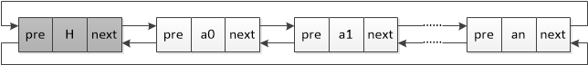

# 线性表

[TOC]


## 一：线性表

线性表及具有线性结构的数据特征。数据由线性索引，具有线性规律。根据内存分配是否连续，线性表分为：**顺序表** 和 **链表** 。

常用操作：

```c++
template <typename T>
class CLinear
{
public:
	CLinear() {}
	virtual ~CLinear() {}

	virtual int capacity() const = 0;
	virtual int length() const = 0;
	virtual bool is_empty() const = 0;
	virtual bool is_full() const = 0;
	virtual void clear() = 0;

	virtual bool insert(int index, const T &x) = 0;
	virtual bool remove(int index) = 0;
	virtual int find(const T &x) const = 0;
	virtual bool get(int index, T &x) const = 0;
	virtual bool set(int index, const T &x) = 0;

	virtual void show() const = 0;
};
```


## 二：顺序表

顺序表基于数组分配，内存为连续区域。根据分配方式不同，顺序表分为：

- **静态方式：** 内存事先分配，固定内存大小；
- **动态方式：** 内存使用时分配，动态扩展内存大小。

这里采用静态方式：

```c++
template <typename T, int size>
class CSeqLinear : public CLinear<T>
{
public:
	CSeqLinear();
	virtual ~CSeqLinear();

	// CLinear
	virtual int capacity() const;
	virtual int length() const;
	virtual bool is_empty() const;
	virtual bool is_full() const;
	virtual void clear();
	virtual bool insert(int index, const T &x);
	virtual bool remove(int index);
	virtual int find(const T &x) const;
	virtual bool get(int index, T &x) const;
	virtual bool set(int index, const T &x);
	virtual void show() const;

	T& operator[](int index);

protected:
	T _data[size];
	int _max_size;
	int _last;
};
```

- _data：数组数据空间，负责数据保存；
- _max_size：最大数据大小；
- _last：最后一位数据的索引，后续位置为空。

### 2.1 功能实现

#### Construction and Destruction

```c++
template <typename T, int size>
CSeqLinear<T, size>::CSeqLinear()
{
	_max_size = size;
	_last = -1;
}

template <typename T, int size>
CSeqLinear<T, size>::~CSeqLinear()
{
}
```

#### capacity

`capacity` 负责返回数组最大大小，结果等于模板中的size，在构造函数中已经保存在 `_max_size` 中：

```c++
template <typename T, int size>
int CSeqLinear<T, size>::capacity() const
{
	return _max_size;
}
```

#### length

`length` 负责返回当前数据大小，由于当前最后一位数据的索引由`_last` 标识，所以length应该等于 _last+1：

```c++
template <typename T, int size>
int CSeqLinear<T, size>::length() const
{
	return (_last + 1);
}
```

#### is_empty

判断当前顺序表是否为空：

```c++
template <typename T, int size>
bool CSeqLinear<T, size>::is_empty() const
{
	return (-1 == _last);
}
```

#### is_full

判断当前顺序表是否已满：

```c++
template <typename T, int size>
bool CSeqLinear<T, size>::is_full() const
{
	return ((_last + 1) == _max_size);
}
```

#### clear

清空当前顺序表。这里无需做内存释放和清空操作，直接置_last=-1即可：

```c++
template <typename T, int size>
void CSeqLinear<T, size>::clear()
{
	_last = -1;
}
```

#### insert

插入操作：在index位置处插入元素x：

```c++
template <typename T, int size>
bool CSeqLinear<T, size>::insert(int index, const T &x)
{
	if (is_full())
		return false;
	if (index < 0 || index > _last + 1)
		return false;

	for (int i = _last; i >= index; i--) {
		_data[i + 1] = _data[i];
	}
	_data[index] = x;
	_last++;

	return true;
}
```

- 首先判断顺序表是否已满，如果已满返回false；之后检查插入位是否合法，允许在最后一位数据的后一位插入，但不允许在后续空位插入，因为这样会导致内存不再连续；

- 在index位插入时：先将 `[index, _last]` 的数据依次向后移动一位；然后使用值 `x` 填充index位；最后_last最后数据位标识加一。

  插入前：

  

  插入后：

  

#### remove

删除操作：移除index处的元素。

```c++
template <typename T, int size>
bool CSeqLinear<T, size>::remove(int index)
{
	if (is_empty())
		return false;
	if (index < 0 || index > _last)
		return false;

	for (int i = index; i < _last; i++) {
		_data[i] = _data[i + 1];
	}
	_last--;

	return true;
}
```

- 首先检测顺序表是否为空，为空返回false；然后检查index是否合法，及是否在`[0, _last]` 有效范围，否则返回false；之后进行删除操作；

- 删除时将index的后续有效位直接依次迁移一位，最后_last减一即可。

  删除前：

  

  删除后：

  

#### find

查找值，返回对应索引，没找到返回-1：

```c++
template <typename T, int size>
int CSeqLinear<T, size>::find(const T &x) const
{
	int index = -1;
	for (int i = 0; i <= _last; i++) {
		if (_data[i] == x) {
			index = i;
			break;
		}
	}

	return index;
}
```

#### get

get提供获得值的方法，同样，后续的 `[]` 也负责返回值：

```c++
template <typename T, int size>
bool CSeqLinear<T, size>::get(int index, T &x) const
{
	if (index < 0 || index > _last)
		return false;

	x = _data[index];
	return true;
}
```

#### set

set提供更改值的方法，不支持插入操作，即更改的索引必须存在：

```c++
template <typename T, int size>
bool CSeqLinear<T, size>::set(int index, const T &x)
{
	if (index < 0 || index > _last)
		return false;

	_data[index] = x;
	return true;
}
```

#### show

show提供顺序表字符化的展现方式，也可以通过重载 `<<` 或者 `to_string` 方式提供字符序列化操作：

```c++
template <typename T, int size>
void CSeqLinear<T, size>::show() const
{
	cout << "{ ";
	for (int i = 0; i <= _last; i++) {
		cout << _data[i] << " ";
	}
	cout << "}" << endl;
}
```

#### operator[]

`[]` 操作符重载，提供下标索引方式：

```c++
template <typename T, int size>
T& CSeqLinear<T, size>::operator[](int index)
{
	if (index < 0 || index > _last)
		assert(0);

	return _data[index];
}
```

### 2.2 应用

#### 功能测试

```c++
void test_linear()
{
	CSeqLinear<int, 100> linear;

	linear.clear();
	for (int i = 0; i < 10; i++) {
		linear.insert(0, i);
	}
	linear.show();

	linear.remove(0);
	linear.remove(0);
	linear.show();

	cout << linear[2] << endl;
}
```

结果输出：


#### 并集操作

略

#### 交集操作

略


## 三：链表

为什么要引入链表？顺序表优缺点比较：

优点：

- 连续存储，内存空间利用率高；
- 可以随机存取任一结点，存取速度快。

缺点：

- 插入或删除操作时都需要移动大量数据，速度慢；
- 难以确定合适的内存大小，扩展不方便。

为了克服顺序表的缺点，引入链表来存储线性表。**链表适用于插入或删除频繁、存储空间需求不定的情况** 。

### 3.1 单链表

单链表结构：

不带附加头（没有单独的头结点）：


带附加头（有单独的头结点）：


这里是附加头结点的链表定义：

```c++
// 结点定义
template <typename T>
struct link_node_t
{
	T data;
	link_node_t<T> *next;
};

template <typename T>
class CSingleList : public CLinear<T>
{
public:
	CSingleList();
	virtual ~CSingleList();

	// CLinear
	virtual int capacity() const;
	virtual int length() const;
	virtual bool is_empty() const;
	virtual bool is_full() const;
	virtual void clear();
	virtual bool insert(int index, const T &x);
	virtual bool remove(int index);
	virtual int find(const T &x) const;
	virtual bool get(int index, T &x) const;
	virtual bool set(int index, const T &x);
	virtual void show() const;

	const link_node_t<T>* get_head();

protected:
	link_node_t<T> *_head;
};
```

- Node的data负责数据保存；next指向下一个Node；
- _head：头结点，数据内容无效，只负责索引。

#### Construction and Destruction

初始化时就要建立头结点，且next置为空：

```c++
template <typename T>
CSingleList<T>::CSingleList()
{
	_head = new link_node_t<T>;
	_head->next = NULL;
}

template <typename T>
CSingleList<T>::~CSingleList()
{
	delete _head;
}
```

#### capacity

由于链表是动态分配的，因此并没有最大大小，这里的 `capacity` 其实和 `length` 效果相同：

```c++
template <typename T>
int CSingleList<T>::capacity() const
{
	return length();
}
```

#### length

获得当前数据元素个数（链表长度）。从头结点开始遍历整个链表，并计数得到个数：

```c++
template <typename T>
int CSingleList<T>::length() const
{
	int count = 0;
	link_node_t<T> *cur_ptr = _head->next;
	while (NULL != cur_ptr)
	{
		count++;
		cur_ptr = cur_ptr->next;
	}

	return count;
}
```

#### is_empty

判断链表是否为空。只有头结点时链表为空：

```c++
template <typename T>
bool CSingleList<T>::is_empty() const
{
	return (NULL == _head->next);
}
```

#### is_full

判断链表是否已满，由于链表并没有设定内存限制，此处会一直返回false：

```c++
template <typename T>
bool CSingleList<T>::is_full() const
{
	return false;
}
```

#### clear

清除链表。包括每个结点的内存释放和头结点的next区域置空。由于单链表需要从前向后索引，因此在销毁前面结点时候要保存后续结点的访问指针，否则会造成无法索引后续结点而导致内存泄漏。

```c++
template <typename T>
void CSingleList<T>::clear()
{
	link_node_t<T> *cur_ptr = _head->next;
	while (NULL != cur_ptr)
	{
		link_node_t<T> *tmp = cur_ptr;
		cur_ptr = cur_ptr->next;
		delete tmp;
	}
	_head->next = NULL;
}
```

#### insert

在索引index处插入元素x。

```c++
template <typename T>
bool CSingleList<T>::insert(int index, const T &x)
{
	if (index < 0 || index > length())
		return false;

	int count = 0;
	link_node_t<T> *pre_ptr = _head;
	link_node_t<T> *cur_ptr = _head->next;
	while (count < index)
	{
		pre_ptr = cur_ptr;
		cur_ptr = cur_ptr->next;
		count++;
	}
	link_node_t<T> *new_ptr = new link_node_t<T>;
	new_ptr->data = x;
	new_ptr->next = cur_ptr;
	pre_ptr->next = new_ptr;

	return true;
}
```

- 链表和顺序表的索引方式不同，对于index位置单链表必须从头结点开始向后索引，通过计数确定index位置；

- 插入时新建结点，并把新结点的next连接到原index结点，把index前结点的next连接到新建结点：

  

- 由于引入了头结点，在头部插入、在中间插入和在尾部插入的情况无需区别对待。否则，需要单独处理在不同位置的插入操作。

#### remove

删除结点。首先定位到index位置，之后将index前结点的next指向index结点的next，再对index结点进行删除。注意删除操作的顺序问题，不要先删除后操作：

```c++
template <typename T>
bool CSingleList<T>::remove(int index)
{
	if (index < 0 || index >= length())
		return false;

	int count = 0;
	link_node_t<T> *pre_ptr = _head;
	link_node_t<T> *cur_ptr = _head->next;
	while (count < index)
	{
		pre_ptr = cur_ptr;
		cur_ptr = cur_ptr->next;
		count++;
	}
	pre_ptr->next = cur_ptr->next;
	delete cur_ptr;

	return true;
}
```

#### find

查找x元素，并返回结点索引，未找到返回-1：

```c++
template <typename T>
int CSingleList<T>::find(const T &x) const
{
	int index = -1;
	link_node_t<T> *cur_ptr = _head->next;
	while (NULL != cur_ptr)
	{
		index++;
		if (cur_ptr->data == x) {
			break;
		}
	}

	return index;
}
```

#### get

获取index结点数据：

```c++
template <typename T>
bool CSingleList<T>::get(int index, T &x) const
{
	if (index < 0 || index >= length())
		return false;

	int count = 0;
	link_node_t<T> *cur_ptr = _head->next;
	while (count < index)
	{
		cur_ptr = cur_ptr->next;
		count++;
	}
	x = cur_ptr->data;

	return true;
}
```

#### set

更改index结点数据：

```c++
template <typename T>
bool CSingleList<T>::set(int index, const T &x)
{
	if (index < 0 || index >= length())
		return false;

	int count = 0;
	link_node_t<T> *cur_ptr = _head->next;
	while (count < index)
	{
		cur_ptr = cur_ptr->next;
		count++;
	}
	cur_ptr->data = x;

	return true;
}
```

#### show

字符化输出：

```c++
template <typename T>
void CSingleList<T>::show() const
{
	cout << "{ ";
	link_node_t<T> *cur_ptr = _head->next;
	while (NULL != cur_ptr)
	{
		cout << cur_ptr->data << " ";
		cur_ptr = cur_ptr->next;
	}
	cout << "}" << endl;
}
```

#### get_head

获得头结点，用于外部索引和处理：

```c++
template <typename T>
const link_node_t<T>* CSingleList<T>::get_head()
{
	return _head;
}
```

#### 测试

```c++
void test_linear()
{
	CSingleList<int> linear;

	linear.clear();
	for (int i = 0; i < 10; i++) {
		linear.insert(0, i);
	}
	linear.show();

	linear.remove(0);
	linear.remove(0);
	linear.show();
}
```

输出：


> 单链表的建立可以采用 **前插法** 或者 **后插法** ，即每次在最前插入新元素和每次在最后插入新元素，这里并未提供相关方法。

### 3.2 循环链表

已知一个单链表结点，要找后续结点很容易，但要找前边结点则不可行，因此引入循环链表，使得单链表首尾相接，这样 **只要知道表中任何一个结点地址，就能遍历表中的任意节点**。

无附加头的单循环链表：


带附加头的单循环链表：


单循环列表的主要操作与单链表类似，只需要更改某些判定条件：

```c++
template <typename T>
class CCircleList : public CLinear<T>
{
public:
	CCircleList();
	virtual ~CCircleList();

	// CLinear
	virtual int capacity() const;
	virtual int length() const;
	virtual bool is_empty() const;
	virtual bool is_full() const;
	virtual void clear();
	virtual bool insert(int index, const T &x);
	virtual bool remove(int index);
	virtual int find(const T &x) const;
	virtual bool get(int index, T &x) const;
	virtual bool set(int index, const T &x);
	virtual void show() const;

	link_node_t<T>* get_head();

protected:
	link_node_t<T> *_head;
};
```

#### Construction and Destruction

初始化头结点，并将next指向自身：

```c++
template <typename T>
CCircleList<T>::CCircleList()
{
	_head = new link_node_t<T>;
	_head->next = _head;
}

template <typename T>
CCircleList<T>::~CCircleList()
{
	delete _head;
}
```

#### capacity

同 `length` 功能：

```c++
template <typename T>
int CCircleList<T>::capacity() const
{
	return length();
}
```

#### length

返回当前元素个数：

```c++
template <typename T>
int CCircleList<T>::length() const
{
	int count = 0;
	link_node_t<T> *cur_ptr = _head->next;
	while (_head != cur_ptr)
	{
		count++;
		cur_ptr = cur_ptr->next;
	}

	return count;
}
```

#### is_empty

判断当前链表是否为空：

```c++
template <typename T>
bool CCircleList<T>::is_empty() const
{
	return (_head == _head->next);
}
```

#### is_full

判读当前链表是否已满：

```c++
template <typename T>
bool CCircleList<T>::is_full() const
{
	return false;
}
```

#### clear

清空当前链表。注意内存释放和头结点重置：

```c++
template <typename T>
void CCircleList<T>::clear()
{
	link_node_t<T> *cur_ptr = _head->next;
	while (_head != cur_ptr)
	{
		link_node_t<T> *tmp = cur_ptr;
		cur_ptr = cur_ptr->next;
		delete tmp;
	}
	_head->next = _head;
}
```

#### insert

在index结点处插入数据x：

```c++
template <typename T>
bool CCircleList<T>::insert(int index, const T &x)
{
	if (index < 0 || index > length())
		return false;

	int count = 0;
	link_node_t<T> *pre_ptr = _head;
	link_node_t<T> *cur_ptr = _head->next;
	while (count < index)
	{
		pre_ptr = cur_ptr;
		cur_ptr = cur_ptr->next;
		count++;
	}
	link_node_t<T> *new_ptr = new link_node_t<T>;
	new_ptr->data = x;
	new_ptr->next = cur_ptr;
	pre_ptr->next = new_ptr;

	return true;
}
```

#### remove

删除index处结点：

```c++
template <typename T>
bool CCircleList<T>::remove(int index)
{
	if (index < 0 || index >= length())
		return false;

	int count = 0;
	link_node_t<T> *pre_ptr = _head;
	link_node_t<T> *cur_ptr = _head->next;
	while (count < index)
	{
		pre_ptr = cur_ptr;
		cur_ptr = cur_ptr->next;
		count++;
	}
	pre_ptr->next = cur_ptr->next;
	delete cur_ptr;

	return true;
}
```

#### find

查找结点，返回相应的索引。没查找到则返回索引-1：

```c++
template <typename T>
int CCircleList<T>::find(const T &x) const
{
	int index = -1;
	link_node_t<T> *cur_ptr = _head->next;
	while (_head != cur_ptr)
	{
		index++;
		if (cur_ptr->data == x) {
			break;
		}
	}

	return index;
}
```

#### get

获得结点值：

```c++
template <typename T>
bool CCircleList<T>::get(int index, T &x) const
{
	if (index < 0 || index >= length())
		return false;

	int count = 0;
	link_node_t<T> *cur_ptr = _head->next;
	while (count < index)
	{
		cur_ptr = cur_ptr->next;
		count++;
	}
	x = cur_ptr->data;

	return true;
}
```

#### set

设置结点值：

```c++
template <typename T>
bool CCircleList<T>::set(int index, const T &x)
{
	if (index < 0 || index >= length())
		return false;

	int count = 0;
	link_node_t<T> *cur_ptr = _head->next;
	while (count < index)
	{
		cur_ptr = cur_ptr->next;
		count++;
	}
	cur_ptr->data = x;

	return true;
}
```

#### show

字符化操作：

```c++
template <typename T>
void CCircleList<T>::show() const
{
	cout << "{ ";
	link_node_t<T> *cur_ptr = _head->next;
	while (_head != cur_ptr)
	{
		cout << cur_ptr->data << " ";
		cur_ptr = cur_ptr->next;
	}
	cout << "}" << endl;
}
```

#### get_head

返回头结点：

```c++
template <typename T>
link_node_t<T>* CCircleList<T>::get_head()
{
	return _head;
}
```

#### 测试

```c++
void test_linear()
{
	CCircleList<int> linear;

	linear.clear();
	for (int i = 0; i < 10; i++) {
		linear.insert(0, i);
	}
	linear.show();

	linear.remove(0);
	linear.remove(0);
	linear.show();
}
```

输出：


#### 循环链表解决约瑟夫问题

约瑟夫问题描述：

一个旅行社要从n个旅客中选出一名旅客，为他提供免费的环球旅行服务。旅行社安排这些旅客围成一个圆圈，从帽子中取出一张纸条，用上面写的正整数m(<n)作为报数值。游戏进行时，从第一个人开始顺时针方向自1开始顺序报数，报到m时停止，报m的人被淘汰出列，然后从他顺时针方向上的下一个人开始重新报数，如此下去，直到圈中只剩下一个人，这个最后的幸存者就是游戏的胜利者，将得到免费的旅行奖励。例如，若 $n=8,m=3$ ，则出列的顺序为3,6,1,5,2,8,4,最初编号为7的旅客将赢得环球旅游机会。


使用循环链表求解：

```c++
void josephus()
{
	int n, m;
	cout << "People Count:" << endl;
	cin >> n;
	cout << "Number Count:" << endl;
	cin >> m;

	CCircleList<int> linear;
	for (int i = 1; i <= n; i++) {
		linear.insert(i - 1, i);
	}
	cout << "Before calculating..." << endl;
	linear.show();

	cout << "Calculating..." << endl;
	link_node_t<int> *cur = linear.get_head();
	link_node_t<int> *pre = NULL;
	while (linear.length() > 1)
	{
		for (int i = 0; i < m; i++) {
			pre = cur;
			cur = cur->next;
		}

		cout << "Queue Out is: " << cur->data << endl;
		pre->next = cur->next;
		delete cur;
		cur = pre->next;
	}

	cout << "After calculating..." << endl;
	linear.show();

	int last = 0;
	linear.get(0, last);
	cout << " The last on is " << last << "!" << endl;
}
```

> 这里的循环列表采用的是不带附加头结点的循环单链表。附加头结点会导致循环时不易处理。

### 3.3 双向链表

双向链表与单链表相比多了前驱指针，即可以通过前驱指针向前索引，而不必要每次只能向后索引。


- 双向链表：

  

- 双向循环链表：

  

- 双向带附加头结点链表：

  

- 双向带附加头结点循环链表：

  

带附加头结点的双向链表：

```c++
template <typename T>
class CDoubleList : public CLinear<T>
{
public:
	CDoubleList();
	virtual ~CDoubleList();

	// CLinear
	virtual int capacity() const;
	virtual int length() const;
	virtual bool is_empty() const;
	virtual bool is_full() const;
	virtual void clear();
	virtual bool insert(int index, const T &x);
	virtual bool remove(int index);
	virtual int find(const T &x) const;
	virtual bool get(int index, T &x) const;
	virtual bool set(int index, const T &x);
	virtual void show() const;

	link_node_t<T>* get_head();

protected:
	link_node_t<T> *_head;
};
```

#### Construction and Destruction

初始化附加头结点：

```c++
template <typename T>
CDoubleList<T>::CDoubleList()
{
	_head = new link_node_t<T>;
	_head->next = _head;
	_head->pre = _head;
}

template <typename T>
CDoubleList<T>::~CDoubleList()
{
	delete _head;
}
```

#### capacity

`capacity` 与 `length` 功能相同：

```c++
template <typename T>
int CDoubleList<T>::capacity() const
{
	return length();
}
```

#### length

与单链表判定方式相同：

```c++
template <typename T>
int CDoubleList<T>::length() const
{
	int count = 0;
	link_node_t<T> *cur_ptr = _head->next;
	while (_head != cur_ptr)
	{
		count++;
		cur_ptr = cur_ptr->next;
	}

	return count;
}
```

#### is_empty

判断链表是否为空：

```c++
template <typename T>
bool CDoubleList<T>::is_empty() const
{
	return (_head == _head->next);
}
```

#### is_full

判断链表是否已满：

```c++
template <typename T>
bool CDoubleList<T>::is_full() const
{
	return false;
}
```

#### clear

清空链表

```c++
template <typename T>
void CDoubleList<T>::clear()
{
	link_node_t<T> *cur_ptr = _head->next;
	while (_head != cur_ptr)
	{
		link_node_t<T> *tmp = cur_ptr;
		cur_ptr = cur_ptr->next;
		delete tmp;
	}
	_head->next = _head;
	_head->pre = _head;
}
```

#### insert

链表插入

```c++
template <typename T>
bool CDoubleList<T>::insert(int index, const T &x)
{
	if (index < 0 || index > length())
		return false;

	int count = 0;
	link_node_t<T> *pre_ptr = _head;
	link_node_t<T> *cur_ptr = _head->next;
	while (count < index)
	{
		pre_ptr = cur_ptr;
		cur_ptr = cur_ptr->next;
		count++;
	}
	link_node_t<T> *new_ptr = new link_node_t<T>;
	new_ptr->data = x;
	new_ptr->next = cur_ptr;
	new_ptr->pre = pre_ptr;
	pre_ptr->next = new_ptr;
	cur_ptr->pre = new_ptr;

	return true;
}
```

#### remove

链表删除

```c++
template <typename T>
bool CDoubleList<T>::remove(int index)
{
	if (index < 0 || index >= length())
		return false;

	int count = 0;
	link_node_t<T> *pre_ptr = _head;
	link_node_t<T> *cur_ptr = _head->next;
	while (count < index)
	{
		pre_ptr = cur_ptr;
		cur_ptr = cur_ptr->next;
		count++;
	}
	pre_ptr->next = cur_ptr->next;
	pre_ptr->next->pre = pre_ptr;
	delete cur_ptr;

	return true;
}
```

#### find

查找

```c++
template <typename T>
int CDoubleList<T>::find(const T &x) const
{
	int index = -1;
	link_node_t<T> *cur_ptr = _head->next;
	while (_head != cur_ptr)
	{
		index++;
		if (cur_ptr->data == x) {
			break;
		}
	}

	return index;
}
```

#### get

获取值：

```c++
template <typename T>
bool CDoubleList<T>::get(int index, T &x) const
{
	if (index < 0 || index >= length())
		return false;

	int count = 0;
	link_node_t<T> *cur_ptr = _head->next;
	while (count < index)
	{
		cur_ptr = cur_ptr->next;
		count++;
	}
	x = cur_ptr->data;

	return true;
}
```

#### set

设置值：

```c++
template <typename T>
bool CDoubleList<T>::set(int index, const T &x)
{
	if (index < 0 || index >= length())
		return false;

	int count = 0;
	link_node_t<T> *cur_ptr = _head->next;
	while (count < index)
	{
		cur_ptr = cur_ptr->next;
		count++;
	}
	cur_ptr->data = x;

	return true;
}
```

#### show

字符化显示：

```c++
template <typename T>
void CDoubleList<T>::show() const
{
	cout << "{ ";
	link_node_t<T> *cur_ptr = _head->next;
	while (_head != cur_ptr)
	{
		cout << cur_ptr->data << " ";
		cur_ptr = cur_ptr->next;
	}
	cout << "}" << endl;
}
```

#### get_head

获得附加头结点：

```c++
template <typename T>
link_node_t<T>* CDoubleList<T>::get_head()
{
	return _head;
}
```


