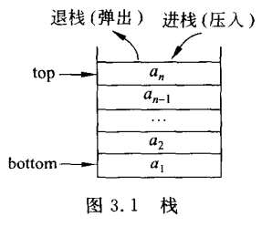

# Stack

[TOC]


##  一：栈

栈属于特殊的线性表，只允许在表末端进行插入和删除，典型特点：**先进后出。**



功能定义：

```c++
template <typename T>
class CStack
{
public:
	CStack() {}
	virtual ~CStack() {}

	virtual int capacity() const = 0;
	virtual int length() const = 0;
	virtual bool is_empty() const = 0;
	virtual bool is_full() const = 0;
	virtual void clear() = 0;

	virtual bool push(const T &x) = 0;
	virtual bool pop(T &x) = 0;
	virtual bool get_top(T &x) const = 0;

	virtual void show() const = 0;
};
```

同样，栈也分为基于数组实现和基于链表实现；基于数组实现的叫 **顺序栈** ，基于链表实现的叫 **链式栈** 。


## 二：顺序栈

功能定义：

```c++
template <typename T, int size>
class CSeqStack : public CStack<T>
{
public:
	CSeqStack();
	virtual ~CSeqStack();

	// CStack
	virtual int capacity() const;
	virtual int length() const;
	virtual bool is_empty() const;
	virtual bool is_full() const;
	virtual void clear();
	virtual bool push(const T &x);
	virtual bool pop(T &x);
	virtual bool get_top(T &x) const;
	virtual void show() const;

protected:
	T _data[size];
	int _max_size;
	int _top;
};
```

- _data：保存数据的内存数组；
- _max_size：栈最大大小；
- _top：当前栈顶索引

### Construction and Destruction

```c++
template <typename T, int size>
CSeqStack<T, size>::CSeqStack()
{
	_max_size = size;
	_top = -1;
}

template <typename T, int size>
CSeqStack<T, size>::~CSeqStack()
{
}
```

### capacity

返回栈最大值

```c++
template <typename T, int size>
int CSeqStack<T, size>::capacity() const
{
	return _max_size;
}
```

### length

返回栈当前大小

```c++
template <typename T, int size>
int CSeqStack<T, size>::length() const
{
	return (_top + 1);
}
```

### is_empty

判断栈是否为空

```c++
template <typename T, int size>
bool CSeqStack<T, size>::is_empty() const
{
	return (-1 == _top);
}
```

### is_full

判断栈是否已满

```c++
template <typename T, int size>
bool CSeqStack<T, size>::is_full() const
{
	return (_top == _max_size - 1);
}
```

### clear

清空栈

```c++
template <typename T, int size>
void CSeqStack<T, size>::clear()
{
	_top = -1;
}
```

### push

压栈

```c++
template <typename T, int size>
bool CSeqStack<T, size>::push(const T &x)
{
	if (is_full())
		return false;

	_top++;
	_data[_top] = x;
	return true;
}
```

### pop

出栈

```c++
template <typename T, int size>
bool CSeqStack<T, size>::pop(T &x)
{
	if (is_empty())
		return false;

	x = _data[_top];
	_top--;
	return true;
}
```

### get_top

获得栈顶元素，但不弹出

```c++
template <typename T, int size>
bool CSeqStack<T, size>::get_top(T &x) const
{
	if (is_empty())
		return false;

	x = _data[_top];
	return true;
}
```

### show

字符化显示

```c++
template <typename T, int size>
void CSeqStack<T, size>::show() const
{
	cout << "{ ";
	for (int i = 0; i <= _top; i++) {
		cout << _data[i] << " ";
	}
	cout << "}" << endl;
}
```


## 三：链式栈

链式栈基于链表实现：

```c++
// Node
template <typename T>
struct link_node_t
{
	T data;
	link_node_t<T> *next;
	link_node_t<T> *pre; // Used for double list
};

template <typename T>
class CListStack : CStack<T>
{
public:
	CListStack();
	virtual ~CListStack();

	// CStack
	virtual int capacity() const;
	virtual int length() const;
	virtual bool is_empty() const;
	virtual bool is_full() const;
	virtual void clear();
	virtual bool push(const T &x);
	virtual bool pop(T &x);
	virtual bool get_top(T &x) const;
	virtual void show() const;

protected:
	link_node_t<T> *_head;
};
```

- 无需附加表头。

### Construction and Destruction

```c++
template <typename T>
CListStack<T>::CListStack()
{
	_head = NULL;
}

template <typename T>
CListStack<T>::~CListStack()
{
}
```

### capacity

`capacity` 与 `length` 功能相同：

```c++
template <typename T>
int CListStack<T>::capacity() const
{
	return length();
}
```

### length

获得栈元素个数

```c++
template <typename T>
int CListStack<T>::length() const
{
	int count = 0;
	link_node_t<T> *cur_ptr = _head;
	while (NULL != cur_ptr)
	{
		cur_ptr = cur_ptr->next;
		count++;
	}

	return count;
}
```

### is_empty

判断栈是否为空

```c++
template <typename T>
bool CListStack<T>::is_empty() const
{
	return (NULL == _head);
}
```

### is_full

判断栈是否已满

```c++
template <typename T>
bool CListStack<T>::is_full() const
{
	return false;
}
```

### clear

清空栈

```c++
template <typename T>
void CListStack<T>::clear()
{
	link_node_t<T> *cur_ptr = _head;
	while (NULL != cur_ptr)
	{
		link_node_t<T> *tmp = cur_ptr;
		cur_ptr = cur_ptr->next;
		delete tmp;
	}
	_head = NULL;
}
```

### push

压栈

```c++
template <typename T>
bool CListStack<T>::push(const T &x)
{
	link_node_t<T> *new_ptr = new link_node_t<T>;
	if (NULL == new_ptr)
		return false;

	new_ptr->data = x;
	new_ptr->next = _head;
	_head = new_ptr;
	return true;
}
```

### pop

出栈

```c++
template <typename T>
bool CListStack<T>::pop(T &x)
{
	if (is_empty())
		return false;

	x = _head->data;
	link_node_t<T> *tmp = _head;
	_head = _head->next;
	delete tmp;
	return true;
}
```

### get_top

获得栈顶元素

```c++
template <typename T>
bool CListStack<T>::get_top(T &x) const
{
	if (is_empty())
		return false;

	x = _head->data;
	return true;
}
```

### show

字符化显示

```c++
template <typename T>
void CListStack<T>::show() const
{
	link_node_t<T> *cur_ptr = _head;
	cout << "{ ";
	while (NULL != cur_ptr)
	{
		cout << cur_ptr->data << " ";
		cur_ptr = cur_ptr->next;
	}
	cout << "}" << endl;
}
```


## 四：栈应用——表达式计算

- 括号匹配
- 中序表达式-->后序表达式


## 五：栈应用——递归

- 定义是递归的
- 数据结构是递归的
- 问题解法是递归的

**汉诺塔问题** ，**递归算法求解斐波那契数列** ，**栈求解斐波那契数列** ，**迭代算法求解斐波那契数列** ，**回溯法求解迷宫问题**。

